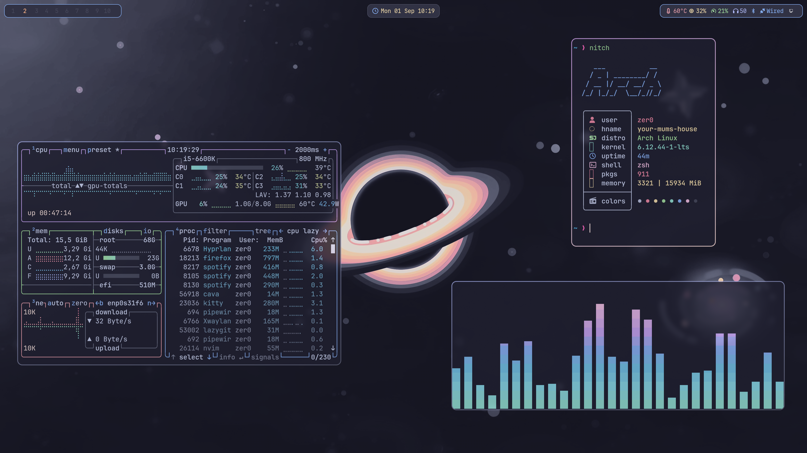

<!--  -->


# Installation
> [!Note]
> #### To install the required packages, run the `install-packages.sh` script.

```bash
git clone https://github.com/Sly-Harvey/dotfiles.git ~/dotfiles
```
```bash
cd ~/dotfiles
```
```bash
./install.sh
```
